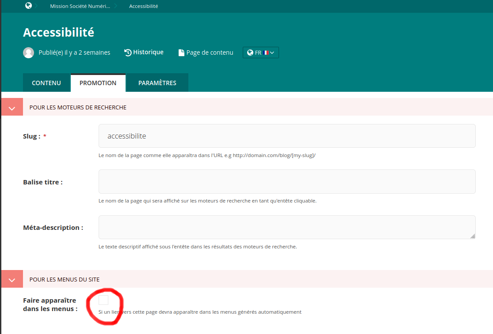
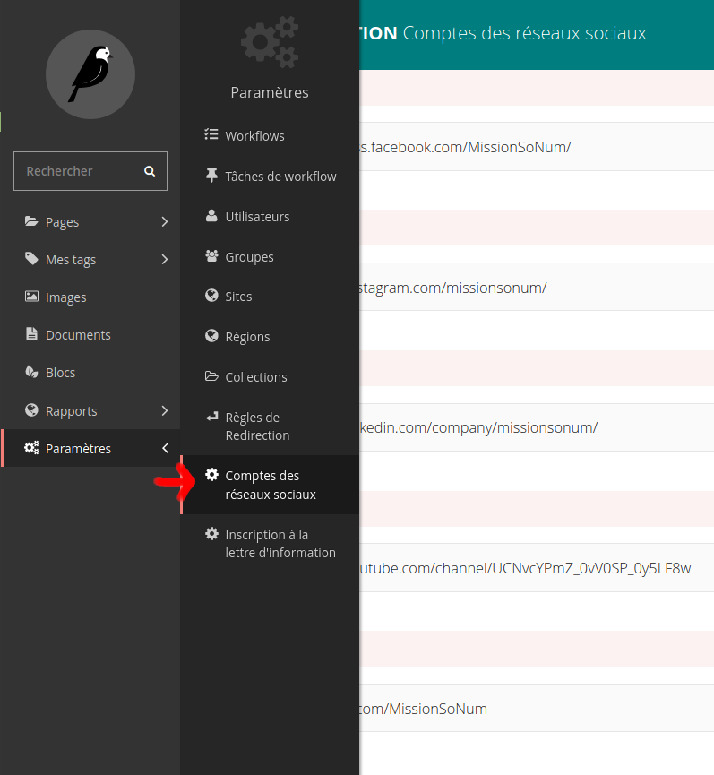

# Site vitrine de Société Numérique

## Configuration du site

La configuration se fait depuis l'interface d'aministration, accessible à cette adresse :
https://sonum.tlscp.fr/admin/.

### Pages

Depuis l'onglet de gauche Pages, sélectionner la page d'accueil ("Mission Société Numérique")
dans la langue à configurer.

Vous avez ensuite accès à la liste des pages. Il suffit de cliquer sur une page pour la modifier.

Pour ajouter une page, il faut cliquer sur le bouton "Ajouter une sous-page".

#### Rendre une page accessible depuis le menu de navigation

Depuis la page d'édition, se rendre dans l'onglet "Promotion", puis cocher la case
"Faire apparaître dans les menus".

### Dispositifs et Actualités/Événements

Les dispositifs et actualités ne sont pas configurés comme des pages. Pour en ajouter ou en
modifier, choisir dans le menu de gauche l'onglet "Blocs".

### Traductions et multi-langue

Aujourd'hui (janvier 2022), le site est configuré pour ne fonctionner qu'en anglais et
français. Si une langue doit être ajoutée, cela demandera quelques ajustements technique.
Le plus simple est de demander à TelesCoop (contact@telescoop.fr).

Les pages peuvent être indépendantes dans les différentes langues, ou être les mêmes pages,
avec des traductions. À notre avis, le plus simple est de définir toutes les pages en
français, et traduire celles qui sont pertinentes en anglais.

Pour traduire une page, un dispositif ou une actualité, il faut cliquer sur le bouton
"Traduire" quand la souris est sur un élément.

Une fois la page traduite, quand des éléments sont ajoutés ou supprimer, il faudra mettre
à jour la synchronisation de la traduction en cliquant sur "Synchroniser les blocs".

### Maintenir les liens des réseaux sociaux

Pour modifier ou ajouter des liens vers des réseaux sociaux, depuis l'interface
d'administration, aller dans l'onglet "Paramètres", puis "Comptes des réseaux sociaux"
ou utiliser [ce lien](https://sonum.tlscp.fr/admin/settings/home/socialmediasettings/2/).

### Éditer le lien d'inscription à la newsletter

De manière quasi-identique à ci-dessus,
aller dans l'onglet "Paramètres", puis "Inscription à la lettre d'information"
ou utiliser [ce lien](https://sonum.tlscp.fr/admin/settings/home/newslettersettings/2/).

### Editer le lien vers le Labo Société Numérique ainsi que sa règle d'affichage

De manière quasi-identique à ci-dessus,
aller dans l'onglet "Paramètres", puis "Labo Société Numérique" et indiquer le lien du Labo

Deux options d'affichage de la promotion du labo sont possibles :
- Ajout d'un bouton d'accès dans le bandeau des réseaux sociaux et de l'inscription à la newsletter.
Dans ce cas il faut cocher la case "Afficher dans le bandeaux des réseaux sociaux ?"
- Ajout d'un encart de promotion du Labo sur la page d'accueil.
Dans ce cas il faut aller modifier directement la page d'accueil
et renseigner les champs correspondants.
Si le champ "Titre pour la mise en avant du Labo" n'est pas renseigné,
alors l'encart ne s'affichera pas.

Il est possible de n'utiliser aucune des deux possibilités ou bien les deux en même temps.

### Pages obligatoires pour un bon fonctionnement

Il y a plusieurs pages à créer dans l'admin pour un bon fonctionnement de l'application.
Ces pages doivent être des sous-pages de la page d'accueil (page racine).

- La page d'accueil avec le slug `accueil`
- Une page actualité avec le slug `actualite`
- Une page notre mission avec le slug `mission`
- Une page accessibilité avec le slug `accessibilite`
- Une page mentions légales avec le slug `mentions-legales`

### Images obligatoire pour un bon fonctionnement

- Une image pour les actualités dont le titre est `journal`

## Pour les développeurs

### Mettre à jour la base de donnée

    python manage.py makemigrations
    python manage.py migrate

### Mettre à jour les traductions :

- Créer ou mettre à jour un fichier de traductions :
    `django-admin makemessages -l fr`
- Renseigner à la main les traductions dans les fichiers .po autogénéré
- Compiler les fichiers de traductions:
    `django-admin compilemessages`

### Utilisation de l'app django Tweets

Cf le README correspondant à l'app Tweets

### Système de traduction utilisé

Le système de traduction utilisé est [wagtail-localize](https://www.wagtail-localize.org/)
> Attention : Si une langue est rajouté il faudra (en plus du système de base de wagtail localize) adapter le switch de langue du header
